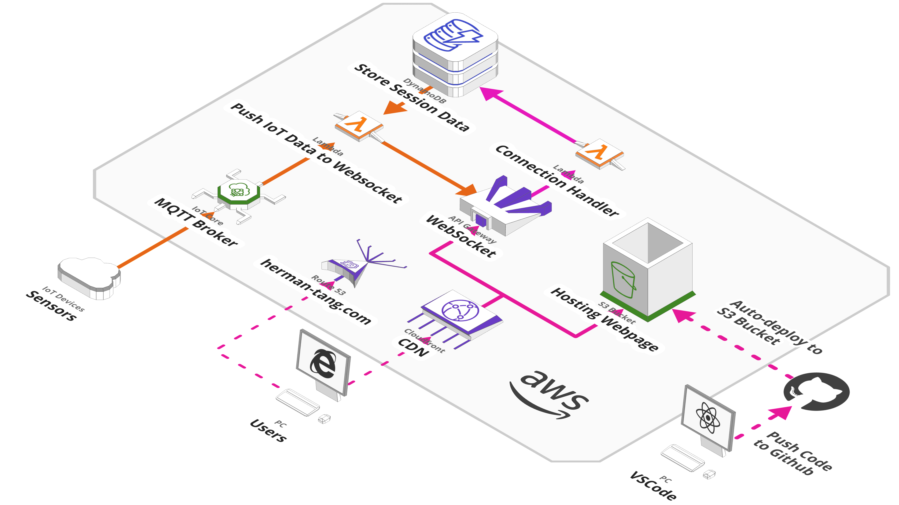

# Herman Tang Personal Website

    
    <a href="https://www.herman-tang.com" target= "_blank">[Website Link]</a>

## Cloud Deployment
This static website is hosted on AWS. Centrally managing and versioning resources with [Cloudformation Template](./react-cors-spa-stack-v2.yaml) IaC.

### Hosting Static Website
- Cloudfront (Global Caching)
- S3 (Host Static Website)
- Route 53 (Public Domain Registration)
- ACM (TLS/SSL Certificate Management)
### IoT Visualization
- API Gateway (Handle WebSocket Connection)
- Lambda (Handle WebSocket Request)
- DynamoDB (Store User Session Info)
- IoT Core (MQTT Broker)

## Sections Included
- Personal Profile
- Realtime IoT Visualization Demo

## Front End
- React
- Typescript
- Styled Components
 
## Manually Run
- yarn install
- yarn run start

## Manually Build
- yarn build start

## CI/CD Workflow
The code will trigger the workflow to build and deploy this static website to my AWS S3 bucket. My AWS credentials are hidden in Github repository secrets.
- [.github/workflows/deploy.yml](.github/workflows/deploy.yml)